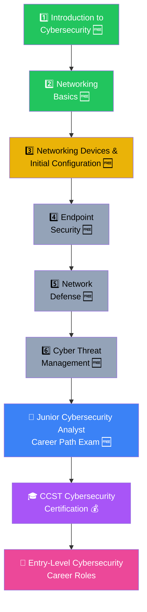

# 🛡️ Junior-Cybersecurity-Analyst
### *My Cybersecurity Learning Roadmap — From Beginner to CCST Certified*

*This README explains what this repository is, my full cybersecurity roadmap, the benefits of each course, and the certification it leads to.* 🚀

---

## ❓ What is this repository about?

**Answer:** 📂 This repository documents my journey through **Cisco Networking Academy's Junior Cybersecurity Analyst Career Path** — a **free, 100% online, beginner-level program** 🆓 that teaches how to **defend and protect organizations from cyber attacks**. It covers everything from cybersecurity basics to threat hunting, and prepares me for the official **CCST Cybersecurity certification**.

> 🌍 *"Cyber threats affect us all — cybersecurity failure is among the top 5 global risks according to the World Economic Forum's Global Risks Report."*

---

## 🗺️ What is my learning roadmap?

**Answer:** Here's the complete path 👇 — six official courses, one final exam, and one industry certification.

🟢 Completed &nbsp;|&nbsp; 🟡 In Progress &nbsp;|&nbsp; ⚪ Upcoming &nbsp;|&nbsp; 🔵 Path Exam &nbsp;|&nbsp; 🟣 Certification &nbsp;|&nbsp; 🌸 Career Outcome

---

## 📋 Full Course List — with Status

| # | 📘 Course | ⏱️ Duration | 💰 Cost | 📌 Status |
|---|---|---|---|---|
| 1 | Introduction to Cybersecurity | ~6 hrs | 🆓 Free | ✅ Completed |
| 2 | Networking Basics | ~22 hrs | 🆓 Free | ✅ Completed |
| 3 | Networking Devices and Initial Configuration | ~22 hrs | 🆓 Free | 🟡 In Progress |
| 4 | Endpoint Security | ~27 hrs | 🆓 Free | ⏳ Upcoming |
| 5 | Network Defense | ~27 hrs | 🆓 Free | ⏳ Upcoming |
| 6 | Cyber Threat Management | ~16 hrs | 🆓 Free | ⏳ Upcoming |
| 📝 | Junior Cybersecurity Analyst Career Path Exam | — | 🆓 Free | ⏳ Upcoming |
| 🎓 | **CCST Cybersecurity Certification Exam** | — | 💰 Paid (~$125 via Pearson VUE) | ⏳ Upcoming |

> ℹ️ **Note:** The entire 120-hour learning path — all 6 courses **plus** the pathway exam — is **completely free** on Cisco Skills for All / NetAcad. Only the **official proctored CCST Cybersecurity exam** at the end carries a certification fee.

---

## 🧩 Benefits of Each Course

### 1️⃣ Introduction to Cybersecurity 🆓✅
- 🌍 Understand **why cybersecurity is a future-proof career**
- 🔍 Explore real-world **cyber attacks and their global impact**
- 🧠 Build the foundational **mindset of a defender**
- 📈 Learn about the growing **cybersecurity workforce gap** and job demand

### 2️⃣ Networking Basics 🆓✅
- 🌐 Learn **how networks operate** — the foundation every analyst needs
- 🔌 Understand devices, connections, and basic data flow
- 🧱 Build the groundwork needed to understand *how* attacks travel through a network
- 🎯 Essential prerequisite for every course that follows

### 3️⃣ Networking Devices and Initial Configuration 🟡🆓
- ⚙️ Learn to configure **routers, switches, and end devices**
- 🛠️ Get hands-on with basic device setup and management
- 🔐 Understand how misconfigured devices become **security weak points**
- 🧩 Strengthen the technical base needed for defense-focused courses ahead

### 4️⃣ Endpoint Security 🆓⏳
- 🖥️ Learn to **secure your network all the way to the edge**
- 🛡️ Understand malware, endpoint protection, and device hardening
- 🔒 Learn practical techniques to protect laptops, phones, and workstations
- 🚧 Build skills to stop attacks *before* they spread further into a network

### 5️⃣ Network Defense 🆓⏳
- 📡 Learn to **monitor and protect networks in real time**
- 🚨 Evaluate and respond to **security alerts**
- 🔥 Get introduced to **firewalls** and defensive network architecture
- 🕵️ Build the skills used daily by **SOC (Security Operations Center) analysts**

### 6️⃣ Cyber Threat Management 🆓⏳
- 📜 Learn **cybersecurity governance** and organizational policy
- 🧭 Build skills in **risk management** and threat prioritization
- 🔎 Practice **forensic investigation** basics and incident response planning
- 🏁 The capstone course that ties every previous skill together

### 📝 Junior Cybersecurity Analyst Career Path Exam 🆓⏳
- ✅ Test your knowledge across **all six courses** in one final assessment
- 🏅 Earn a **digital badge** proving your skills are verified
- 📄 Add a recognized credential to your **resume and LinkedIn**

### 🎓 CCST Cybersecurity Certification 💰⏳
- 🏆 Earn an **industry-recognized, entry-level Cisco certification**
- 💼 Prove readiness for real cybersecurity job interviews
- 📈 Stand out for entry-level hiring pipelines worldwide

---

## 🎯 What will I be able to do once I complete this roadmap?

**Answer:** By the time I finish this full career path, I will be able to: ✅

- 🌐 Explain how networks operate and where vulnerabilities commonly appear
- ⚙️ Configure basic **network devices** securely
- 🖥️ Apply **endpoint security** techniques to protect devices at scale
- 🚨 Monitor a network, evaluate **security alerts**, and respond to threats
- 🧭 Perform basic **risk management**, threat hunting, and incident response
- 🔥 Understand and apply **firewall** and network defense fundamentals
- 🔐 Speak confidently about **cryptography, governance, and cyber risk**

---

## 💼 What career opportunities does this roadmap unlock?

| Stage Completed | Career Roles Unlocked |
|---|---|
| ✅ Intro to Cybersecurity + Networking Basics | Foundational IT/Security knowledge, internship-ready |
| ✅ + Networking Devices & Initial Config | Tier 1 Help Desk Support |
| ✅ + Endpoint Security & Network Defense | Cybersecurity Technician |
| ✅ + Cyber Threat Management | Junior Cybersecurity Analyst |
| ✅ + CCST Cybersecurity Certification | Certified entry-level roles at **SOC teams, MSSPs, and IT security departments** |

---

## 🚀 In-Demand Skills This Path Builds

---

### 🌟 Progress Tracker 🌟

*"Every alert, every log, every configuration — one step closer to becoming a cyber defender."* 🛡️💻

